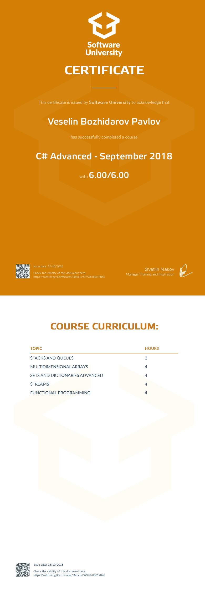

<a href="https://softuni.bg/trainings/courses" rel="Courses">  ![SoftUni logo][logo] <a/>

[logo]: http://innovationstarterbox.bg/wp-content/uploads/2016/05/Softuni_logo_trasparent.png "Logo Title Text 2"

---
The C # Advanced course examines the .NET platform, as well as working with the C # language above the startup. This includes coding skills, problem solving skills, familiarizing with standard tools for working (.NET Framework), word processing tools, linear and tree collections, and working with files and directories. Particular attention is paid to the functional programming paradigm as well as to the basic tool bundling it - LINQ to process data streams.

# Course: C# Advanced

## Topics:
01. Stacks and Queues
02. Multidimensional Arrays
03. Sets and Dictionaries Advanced
04. Streams
05. Functional Programming

## Certificate: 

 
